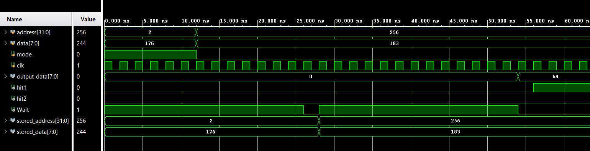
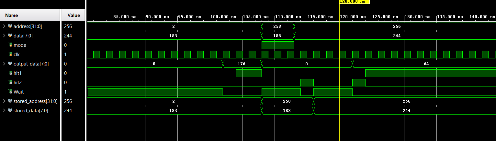

# 🧠 Two-Level Cache Controller (L1 + L2)

A **Verilog behavioral model** of a two-level cache hierarchy that demonstrates how a processor accesses data through **L1 Cache → L2 Cache → Main Memory**.

The project focuses on **cache hits, misses, multi-cycle latency, LRU replacement, block promotion, eviction, and writeback** through simulation.

## 📌 Cache Hierarchy

```text
                 Read / Write
                     │
                     ▼
              ┌─────────────┐
              │  Processor  │
              └──────┬──────┘
                     │
                     ▼
              ┌─────────────┐
              │  L1 Cache   │
              │ Direct Map  │
              └──────┬──────┘
                     │ Miss
                     ▼
              ┌─────────────┐
              │  L2 Cache   │
              │  4-Way Set  │
              │ Associative │
              └──────┬──────┘
                     │ Miss
                     ▼
              ┌─────────────┐
              │ Main Memory │
              └─────────────┘
```

### Memory Specifications

| Level | Organization | Size | Access Latency |
|---|---|---:|---:|
| **L1** | Direct-mapped | 64 lines × 4 bytes | 1 cycle |
| **L2** | 4-way set-associative + LRU | 128 sets × 4 ways × 4 bytes | 3 cycles |
| **Main Memory** | — | 16,384 blocks × 4 bytes (64 KB) | 10 cycles |

## ⚙️ How It Works

For every processor request:

1. **Check L1** — Hit → return/update data. Miss → move to L2.
2. **Check L2** — Hit → update LRU and promote the block to L1. Miss → access main memory.
3. **Main Memory** — Fetch the block, install it into L2, then promote it to L1.
4. When space is needed, the controller handles **eviction and writeback**.

The controller also provides:
- `hit1` → L1 hit indicator
- `hit2` → L2 hit indicator
- `Wait` → indicates that the request is still being serviced

## 🧩 Key Concepts

- **Cache Hit/Miss:** Searches the faster cache levels before accessing slower memory.
- **LRU Replacement:** L2 replaces the least recently used block when a set is full.
- **Block Promotion:** A block found in L2 is moved to L1 for faster future access.
- **Eviction & Writeback:** Replaced blocks are written to the next memory level when required.
- **Multi-Cycle Latency:** Different access times are modeled for L1, L2, and main memory.

## 📊 Simulation Results

The following waveforms show the cache controller during simulation.

### Waveform 1



### Waveform 2



The waveforms show processor addresses/data and control signals such as hit detection, `Wait`, and cache operations.

## 📁 Repository Structure

```text
├── Output/
│   ├── Cache_controller_1.png
│   └── Cache_controller_2.png
│
├── RTL Desgin/
│   └── Cache controller RTL files
│
├── Testbench/
│   └── Simulation / testbench files
│
└── README.md
```

## 🛠️ Implementation

**Language:** Verilog  
**Type:** Behavioral / Functional Simulation  
**Purpose:** Computer Architecture & Cache Memory Study

> ⚠️ This is a **simulation model**, not synthesis-ready RTL. Behavioral constructs and hierarchical memory access are used to focus on demonstrating cache functionality.

## 🎯 Simple Analogy

> Think of **L1 as your desk**, **L2 as a nearby cupboard**, and **main memory as a storage room**.  
> You check your desk first because it is fastest. If the item isn't there, you check the cupboard, and only then go to the storage room.

## 👨‍💻 Author

**Nem Desai**  
B.Tech. Electronics & Communication Engineering | Minor in Data Science  
Nirma University
